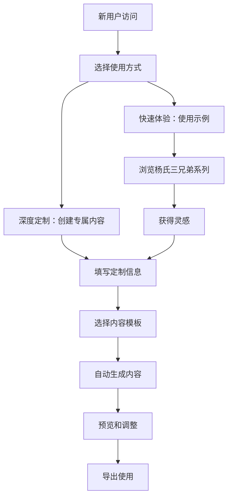

# 🌟 通用化儿童教育内容创作平台设计方案

## 🎯 新项目定位
**目标**：打造一个开源的、可定制的儿童教育内容创作平台，让任何家庭、教育者都能轻松为孩子们创建个性化的学习内容。

## 📛 项目命名方案（通用化）

### 方案一：童话编程坊 (StoryCode Studio)
- **特色**：强调故事化编程教育
- **适用**：技术教育导向的家庭

### 方案二：小小创作家 (Little Creators Hub)
- **特色**：培养孩子的创作能力
- **适用**：注重创意培养的教育者

### 方案三：智慧种子园 (WisdomSeed Garden) ⭐ **推荐**
- **特色**：教育内容如种子，在孩子心中生根发芽
- **适用**：通用性强，寓意深刻

### 方案四：梦想学堂 (DreamLand Academy)
- **特色**：每个孩子都有自己的梦想学堂
- **适用**：温馨而有抱负的感觉

### 方案五：开源教育工坊 (OpenEdu Workshop)
- **特色**：直接明确的开源教育平台
- **适用**：技术社区和教育开发者

## 🏗️ 平台架构设计

### 核心理念
```
📚 内容模板化 + 🛠️ 工具自动化 + 👨‍👩‍👧‍👦 个性定制 = 🌟 无限可能
```

### 平台功能层次
```
🏠 用户层
├── 👨‍👩‍👧‍👦 家长/教育者
├── 👶 儿童学习者  
└── 🤝 开源贡献者

🎨 内容层
├── 📖 故事模板库
├── 🎯 学科知识点
├── 🖼️ 多媒体资源
└── 🎮 互动元素

🛠️ 工具层
├── 📝 内容生成引擎
├── 🎨 主题定制系统
├── 📱 多端输出工具
└── 📊 学习效果跟踪

🔧 技术层
├── 🌐 Web技术栈
├── 📦 模块化架构
├── 🔄 自动化流水线
└── 📚 完整文档体系
```

## 📋 通用化改造计划

### 1. 项目结构重组
```
WisdomSeed-Garden/
├── 📁 templates/              # 内容模板库
│   ├── 🎭 故事模板/
│   ├── 📚 学科模板/
│   ├── 🎨 主题样式/
│   └── 🎮 互动组件/
├── 📁 examples/               # 示例项目
│   ├── 👦 杨氏三兄弟系列/     # 作为示例保留
│   ├── 👧 女孩版示例/         # 新增
│   └── 🏫 教室通用版/         # 新增
├── 📁 tools/                  # 创作工具集
│   ├── 🎯 内容生成器/
│   ├── 🎨 主题定制器/
│   ├── 📱 多端导出器/
│   └── 🔧 资源管理器/
├── 📁 resources/              # 通用资源库
│   ├── 🖼️ 图片素材库/
│   ├── 🎵 音频资源/
│   ├── 🎨 UI组件库/
│   └── 📖 知识点库/
├── 📁 docs/                   # 完整文档
│   ├── 🚀 快速入门/
│   ├── 📖 用户手册/
│   ├── 🛠️ 开发指南/
│   └── 🤝 贡献指南/
└── 📁 community/              # 社区交流
    ├── 💡 创意分享/
    ├── 🐛 问题反馈/
    └── 🎯 功能请求/
```

### 2. 核心功能设计

#### 🎯 内容生成向导
```python
# 示例：3步生成个性化故事
1. 选择模板："冒险故事" / "学科学习" / "品格教育"
2. 输入信息：孩子姓名、年龄、兴趣爱好、学习目标
3. 自动生成：个性化的完整学习故事 + 配套练习
```

#### 🎨 主题定制系统
```css
/* 可配置的主题参数 */
:root {
  --primary-color: /* 主色调 */
  --character-name: /* 主角名字 */
  --story-theme: /* 故事主题 */
  --difficulty-level: /* 难度等级 */
}
```

#### 📱 一键多端导出
- 📱 **移动端**：响应式HTML，适合平板阅读
- 📄 **PDF版本**：打印友好，制作实体书籍
- 📺 **演示版**：适合课堂投影教学
- 🎮 **互动版**：游戏化学习体验

### 3. 用户使用流程


## 🌍 开源社区规划

### 贡献方式
1. **内容创作者**：分享新的故事模板和学习内容
2. **设计师**：贡献UI主题和视觉素材
3. **开发者**：改进工具功能和技术架构
4. **教育者**：提供教学实践反馈和需求
5. **家长**：分享使用经验和效果反馈

### 社区激励机制
- 🏆 **贡献者排行榜**
- 🎖️ **优秀内容推荐**
- 🤝 **合作项目机会**
- 📢 **成果展示平台**

## 📊 项目价值主张

### 对家长
- ✅ **零技术门槛**：图形化操作，3分钟上手
- ✅ **完全定制**：孩子姓名、兴趣、学习目标
- ✅ **效果显著**：故事化学习，提高兴趣和记忆
- ✅ **成本友好**：开源免费，无额外费用

### 对教育者
- ✅ **丰富资源**：大量现成模板和素材
- ✅ **教学创新**：个性化内容制作工具
- ✅ **课堂适配**：支持投影、打印等多种形式
- ✅ **持续更新**：社区共建，资源不断丰富

### 对开发者
- ✅ **技术栈现代**：基于Web标准，易于维护
- ✅ **架构清晰**：模块化设计，便于扩展
- ✅ **文档完善**：详细的开发和贡献指南
- ✅ **影响力大**：教育领域的开源项目

## 🚀 实施路线图

### Phase 1: 基础重构 (2-3周)
- [ ] 项目结构重组
- [ ] 核心文档重写
- [ ] 基础工具通用化

### Phase 2: 模板系统 (3-4周)
- [ ] 提取通用模板
- [ ] 创建配置系统
- [ ] 开发生成向导

### Phase 3: 社区建设 (ongoing)
- [ ] 完善贡献指南
- [ ] 建立反馈机制
- [ ] 推广和用户增长

## 💡 核心创新点

1. **故事化教育**：将枯燥的知识点包装成有趣的冒险故事
2. **个性化定制**：每个孩子都能成为故事的主角
3. **工具化生产**：从手工制作到批量定制的转变
4. **开源生态**：汇聚全球教育创新者的智慧
5. **多端适配**：适应不同的学习场景和设备